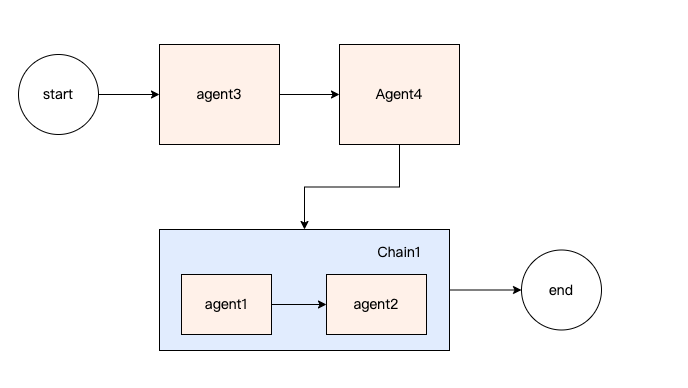

# Chain 执行链

执行链，是有多个 Agent 进行编排、组合形成的一个链条⛓。一个强大的 AI 功能，往往是需要组合多个智能体来共同完成的。

在 Chain 执行链中，一般情况下是由第一个 Agent 执行，执行的结果交给第二个 Agent 继续协作，之后再交给第三个 Agent，以此类推，最终得到我们需要的结果。

而执行链在执行的过程中，可能需要暂停等等用户的交互或数据输入，执行链才能恢复继续执行。为此，每个 Chain 执行链多有许多不同的状态，状态常量如下：

```java
public enum ChainStatus {

    READY(0), // 未开始执行
    START(1), // 已开始执行，执行中...
    PAUSE_FOR_WAKE_UP(5), //暂停等待唤醒
    PAUSE_FOR_INPUT(6), //暂停等待数据输入
    ERROR(7), //发生错误
    FINISHED_NORMAL(10), //正常结束
    FINISHED_ABNORMAL(11), //错误结束
    ;

    final int value;

    ChainStatus(int value) {
        this.value = value;
    }
}
```
## 执行链的类型

为了满足不同的场景，Agents-Flex 提供了如下几种执行链：
- SequentialChain：顺序执行链
- ParallelChain：并发（并行）执行链
- LoopChain：循环执行连，可用于两（或多个）个模型之间进行对弈（比如两个大模型在下象棋）或者类似 `斯坦福 AI 小镇` 等功能。

## 感知
执行链（Chain）在执行的过程中，会在不同的阶段发出执行事件的通知，另外每个智能体在执行的过程中，也可能会发布自己的自定义事件。

每个智能体可以通过去实现 `ChainEventListener` 来感知 Chain 的执行变化，通过这种方式赋予 Agent 感知世间的能力。

## 示例代码

**示例代码1**： 通过 `SequentialChain` 执行，并得到一个结果：

```java
public static void main(String[] args) {
    SequentialChain ioChain1 = new SequentialChain();
    ioChain1.addNode(new Agent1("agent1"));
    ioChain1.addNode(new Agent2("agent2"));

    SequentialChain ioChain2 = new SequentialChain();
    ioChain2.addNode(new Agent1("agent3"));
    ioChain2.addNode(new Agent2("agent4"));
    ioChain2.addNode(ioChain1);

    ioChain2.registerEventListener(new ChainEventListener() {
        @Override
        public void onEvent(ChainEvent event, Chain chain) {
            System.out.println(event);
        }
    });


    Object result = ioChain2.executeForResult("your params");
    System.out.println(result);
}
```

以上代码实现了如下图所示的 Agents 编排：




---

**示例代码2** ： 执行链在执行的过程中暂停，等待用户输入后继续执行

```java
public static void main(String[] args) {

    SimpleAgent1 agent1 = new SimpleAgent1();
    SimpleAgent2 agent2 = new SimpleAgent2();

    Chain chain = new SequentialChain(agent1, agent2);
    chain.registerInputListener((chain1, parameters) -> {
        Parameter parameter = parameters.get(0);
        System.out.println("请输入 " + parameter.getName());

        Scanner scanner = new Scanner(System.in);
        String userInput = scanner.nextLine();

        Map<String, Object> variables = new HashMap<>();
        variables.put(parameter.getName(), userInput);

        //让 chain 恢复执行
        chain.resume(variables);
    });

    //开始执行
    chain.execute(new HashMap<>());

    //输出结果（多个结果）
    for (Map.Entry<String, Object> entry : chain.getMemory().getAll().entrySet()) {
        System.out.println("执行结果" + entry);
    }
}
```
